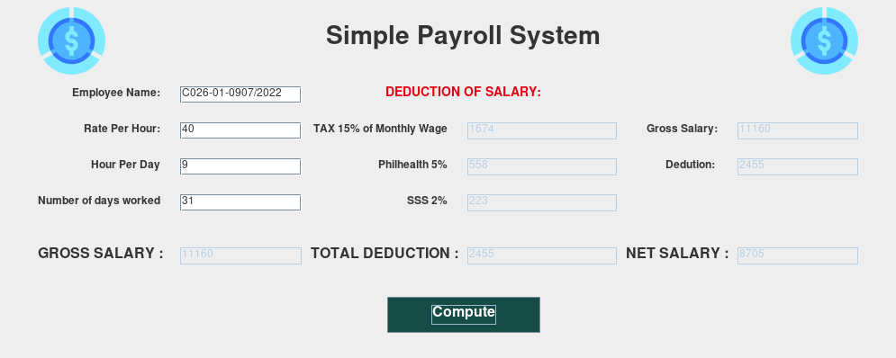

# simple-payroll
Simple payroll system implemented using java swing.

 

 

# How to use
<ul>
  <li>Clone the repo to your computer</li>
  <li>Open a terminal in the cloned directory</li>
  <li>Run the following commands</li>
  
* `$ javac main.java`
* `$ java main`

  <li>Type your inputs and calculate away</li>
</ul>

